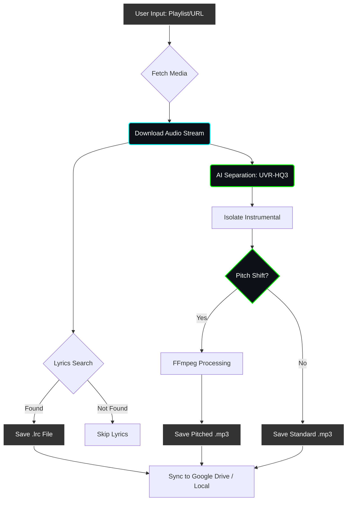

# 🎤 Karaoke-Cloud

[](https://www.python.org/)
[](https://ffmpeg.org/)
[](https://opensource.org/licenses/MIT)

A powerful, open-source automation tool that extracts **Instrumentals** and **Synced Lyrics** from online media playlists. It features AI-powered vocal separation and studio-quality pitch shifting.

Designed to run **locally** or in the **cloud**, allowing you to process entire playlists and sync them directly to your phone or Smart TV.

---

## ⚖️ Legal Disclaimer

> **⚠️ PLEASE READ CAREFULLY:**
> This tool is provided strictly for **educational and research purposes**.
> * **Input Source:** Users must comply with the Terms of Service of the hosting platform.
> * **No Hosting:** The creators do not host, distribute, or store any copyrighted audio or lyric files.
> * **User Responsibility:** You are solely responsible for ensuring you have the legal right to process the content you input.
> * **"As Is":** This software is provided without warranty of any kind.

---

## ⚡ How It Works


## 🚀 Features

* **Playlist Automation:** Processes single links or entire playlists in one go.
* **AI Separation:** Uses the high-performance `UVR-MDX-NET-Inst_HQ_3` model for clean instrumental isolation.
* **Vocal Pitch Shifting:** Change keys (Male ↔ Female) without altering the tempo.
* **Synced Lyrics:** Automatically fetches `.lrc` files for karaoke display.
* **Cloud Ready:** Optimized for Google Colab with direct Google Drive syncing.

---

## ☁️ Quick Start: Cloud Mode (Phone Monitor)
*No installation required. Runs on Google's servers, saves to your Drive.*

1.  Open **[Google Colab](https://colab.research.google.com)**.
2.  Create a new notebook and paste the following code into the first cell:
    ```python
    !git clone [YOUR_GITHUB_REPO_URL]
    %cd Karaoke-Cloud
    from google.colab import drive
    drive.mount('/content/drive')
    !apt-get install ffmpeg -y
    !pip install -r requirements.txt
    !python cli.py
    ```
3.  Run the cell.
4.  Paste your **Media Playlist URL** when prompted.
5.  **Monitor on Phone:** Open the **Google Drive App** on your phone and watch the `KaraokeOutput` folder populate with files automatically.

---

## 💻 Local Installation (PC / Mac / Linux)

### Prerequisites
* **Python 3.10+**
* **FFmpeg** (Must be installed and added to System PATH).

### Setup
1.  **Clone or Download** this repository.
2.  Open your terminal/command prompt in the project folder.
3.  Install dependencies:
    ```bash
    pip install -r requirements.txt
    ```

### Usage
**Option 1: Command Line (Fastest)**
Best for batch processing playlists.
```bash
python cli.py
```
**Option 2: Visual Dashboard**
Best for single track processing with a user interface.
```bash
streamlit run app.py
```

## 📺 How to Play on TV (Android TV / Smart TV)

This tool generates standard karaoke files compatible with most players.

1.  **Transfer Files:** Copy the generated `.mp3` (Audio) and `.lrc` (Lyrics) files to a USB drive or access them via a Cloud File Manager on your TV.
2.  **Naming Rule:** Ensure both files have the **exact same filename**:
    * `Track01_Instrumental.mp3`
    * `Track01_Instrumental.lrc`
3.  **Recommended Apps:**
    * **VLC for Android:** automatically detects the lyrics file.
    * **Kodi:** Supports advanced karaoke tagging.
    * **ALSong:** Dedicated lyrics player.

---

## 📂 Output Structure

All processed files are organized as follows:

| File Type | Suffix | Description |
| :--- | :--- | :--- |
| **Lyrics** | `.lrc` | Time-synced lyrics file. |
| **Instrumental** | `_Inst.mp3` | The isolated instrumental track. |
| **Pitched** | `_Pitched.mp3` | (Optional) Key-shifted version for vocal range adjustment. |