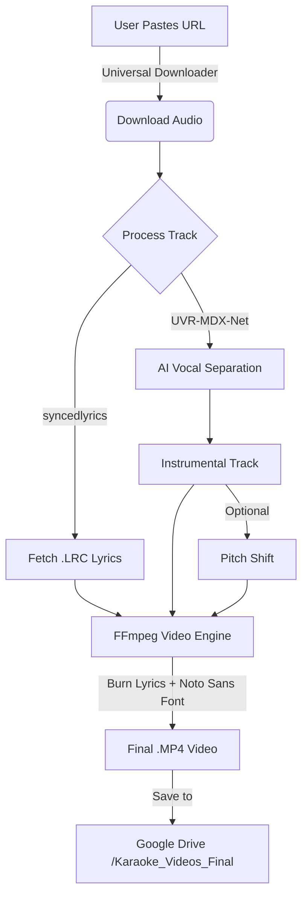

# ☁️ Karaoke-Cloud

[](https://colab.research.google.com/github/YOUR_USERNAME/Karaoke-Cloud/blob/main/Start_Here.ipynb)
[](https://www.python.org/)
[](https://ffmpeg.org/)
[](https://opensource.org/licenses/MIT)

**Turn any audio link into a high-quality Karaoke Video with synchronized lyrics.**

This tool uses AI to separate vocals from music, fetches synchronized lyrics, and generates a video file ready for your TV. All running for free on Google Colab's T4 GPU.

---

## 🚀 Quick Start (The Easy Way)

1.  **Click the "Open in Colab" badge** above.
2.  **IMPORTANT: Activate GPU**
    * Go to the top menu: `Runtime` > `Change runtime type`
    * Set **Hardware accelerator** to `T4 GPU`
    * Click `Save`
3.  **Run Cell 1:** Initialize the system (Mounts Drive & Installs Universal Fonts).
4.  **Run Cell 2:** Process your songs (Download + Separate + Lyrics).
5.  **Run Cell 3:** Batch convert your songs into **MP4 Videos** for your TV.

---

## 🔗 Supported Sources

Unlike standard tools, Karaoke Cloud is **source agnostic**. You can paste links from:

* **SoundCloud** (Great for covers & remixes)
* **Internet Archive** (Public domain & classic recordings)
* **Bandcamp** (Support independent artists directly)
* **Mixcloud** (DJ Sets - *Instrumental extraction only*)
* **Direct MP3/WAV Links**

---

## 🛠️ How It Works


## ✨ Features

* **⚡ 100% Free GPU Acceleration:** Processes a song in ~45 seconds (vs 30 mins on CPU).
* **🌍 Multi-Language Support:** Automatically installs `Noto Sans` to render Hindi, Japanese, and Unicode lyrics correctly on video.
* **📺 TV-Ready Videos:** Automatically creates 1080p black-screen videos with **large, bright yellow lyrics** burned in (optimized for living room viewing).
* **🎹 Pitch Shifter:** Change the key (Male ↔ Female) without affecting tempo.
* **📊 Session Logging:** Creates a `.csv` report for every session, tracking which songs were processed successfully.

---

## 📂 Output Structure

After running the tool, check your Google Drive for a folder named **`KaraokeOutput`**.

| File / Folder | Description |
| :--- | :--- |
| **`/Karaoke_Videos_Final`** | **📺 COPY THIS TO YOUR USB.** Contains the ready-to-play MP4 videos. |
| `SongName_Inst.mp3` | The isolated instrumental track. |
| `SongName.lrc` | The synchronized lyrics file. |
| `SongName_Original.mp3` | Backup of the original audio. |
| `Report_Audio_TIMESTAMP.csv` | Log of all audio processing attempts. |
| `Report_Video_TIMESTAMP.csv` | Log of all video generation attempts. |

---

## 💻 Manual Installation (Local Power Users)

If you have a powerful NVIDIA GPU and want to run this locally instead of on Colab:

1.  **Clone the repo:**
    ```bash
    git clone [https://github.com/YOUR_USERNAME/Karaoke-Cloud.git](https://github.com/YOUR_USERNAME/Karaoke-Cloud.git)
    cd Karaoke-Cloud
    ```

2.  **Install Requirements:**
    ```bash
    pip install -r requirements.txt
    pip install "audio-separator[gpu]"
    ```
    *(Note: You must have FFmpeg installed and added to your system PATH)*

3.  **Run the CLI:**
    ```bash
    python cli.py
    ```

---

## ⚖️ Legal Disclaimer

> **⚠️ PLEASE READ CAREFULLY:**
> This tool is provided strictly for **educational and research purposes**.
> * **Input Source:** Users must comply with the Terms of Service of the hosting platform.
> * **No Hosting:** The creators do not host, distribute, or store any copyrighted audio or lyric files.
> * **User Responsibility:** You are solely responsible for ensuring you have the legal right to process the content you input.
> * **"As Is":** This software is provided without warranty of any kind.

---


