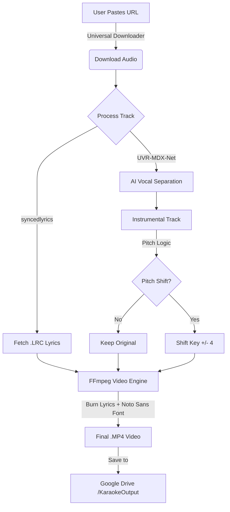

# ☁️ Karaoke-Cloud

[](https://colab.research.google.com/github/vg2601/Karaoke-Cloud/blob/main/Start_Here.ipynb)
[](https://www.python.org/)
[](https://ffmpeg.org/)
[](https://opensource.org/licenses/MIT)

**Turn any audio link into a high-quality Karaoke Video with synchronized lyrics.**

This tool uses AI to separate vocals from music, fetches synchronized lyrics, and generates a video file ready for your TV. All running for free on Google Colab's T4 GPU.

---

## 🚀 Google Colab User Guide

Follow these steps to run the project entirely in the cloud (no installation required).

### **Step 1: Open & Setup**
1.  **Click the badge:** [](https://colab.research.google.com/github/vg2601/Karaoke-Cloud/blob/main/Start_Here.ipynb)
2.  **Activate GPU (Crucial):**
    * Go to the top menu: `Runtime` > `Change runtime type`.
    * Set **Hardware accelerator** to `T4 GPU`.
    * Click `Save`.
3.  **Run Cell 1 (Initialize):**
    * Click the "Play" button (▶️) on the first cell.
    * Click **"Connect to Google Drive"** when asked.
    * *Wait until you see:* `✅ System Ready!`

### **Step 2: Choose Your Mode (Cell 2)**
In the second cell, look for the dropdown menu labeled `MODE`.

#### **Option A: "Command Line (Fast)" (Recommended)**
* **Select:** `Command Line (Fast)` in the dropdown.
* **Click Play.**
* **Follow the text prompts** that appear at the bottom of the cell:
    1.  **Paste Source URL:** (e.g., SoundCloud, Internet Archive, Bandcamp, or direct MP3 link).
    2.  **Select Output Key:** (Choose `1`, `2`, or `3` - *See Pitch Guide below*).
    3.  **Generate TV Video?** (Type `y` for Yes, `n` for No).

#### **Option B: "Visual Dashboard"**
* **Select:** `Visual Dashboard` in the dropdown.
* **Click Play.**
* **Click the Link:** A URL ending in `.loca.lt` will appear. Click it to open the graphical interface.
* **In the Dashboard:**
    * Paste your audio link.
    * Select your **Target Key** from the dropdown menu.
    * Check **"Generate TV Video"** if you want the MP4 file.
    * Click **"Start Processing"**.

### **Step 3: Batch Video / Full Vocals (Cell 3)**
* **Status:** **Optional.**
* **When to use:**
    * If you skipped video generation in Step 2 but changed your mind.
    * If you want to generate **Full Vocal** videos (original audio + lyrics) for listening/learning.
* **Action:** Click Play. It will scan your Drive and process all files automatically.

---

## 🎤 Pitch Shifting Guide

Karaoke Cloud uses high-quality time-stretching to change the key of the song **without changing the speed**. Use this table to decide which option to select:

| Option | Effect | Semitones | Best For... |
| :--- | :--- | :--- | :--- |
| **1. Original Key** | No Change | `0` | Singing the song exactly as the original artist did. |
| **2. Male ➔ Female** | **Higher** | `+4` | **Female singers** covering songs originally sung by men. Raises the pitch to a comfortable female range. |
| **3. Female ➔ Male** | **Lower** | `-4` | **Male singers** covering songs originally sung by women. Lowers the pitch to a deeper male range. |

> **💡 Note:** The +/- 4 semitone shift is the industry standard for karaoke "Gender Swaps," but it works for anyone just looking to adjust a song that is too high or too low for their voice.

---

## 🔗 Supported Sources

Unlike standard tools, Karaoke Cloud is **source agnostic**. You can paste links from:

* **SoundCloud** (Great for covers & remixes)
* **Internet Archive** (Public domain & classic recordings)
* **Bandcamp** (Support independent artists directly)
* **Mixcloud** (DJ Sets - *Instrumental extraction only*)
* **Direct MP3/WAV Links**

---

## 🛠️ How It Works


## ✨ Features

* **⚡ 100% Free GPU Acceleration:** Processes a song in ~45 seconds (vs 30 mins on CPU).
* **📱 Universal Flashcard Player:** Auto-generates a `Player.html` file to play lyrics on any phone with **"Group Sync"** and **"Tap-to-Catch-Up"** features.
* **🌍 Multi-Language Support:** Automatically installs `Noto Sans` to render Hindi, Japanese, and Unicode lyrics correctly on video.
* **📺 TV-Ready Videos:** Automatically creates 1080p black-screen videos with **large, bright yellow lyrics** burned in.
* **🎹 Pitch Shifter:** Professional-grade key change that preserves audio quality and tempo.

---

## 📂 Output Structure

After running the tool, check your Google Drive for a folder named **`KaraokeOutput`**.

| File / Folder | Description |
| :--- | :--- |
| **`/Karaoke_Videos_Final`** | **📺 COPY THIS TO YOUR USB.** Contains the ready-to-play MP4 videos. |
| `Player.html` | **📱 FLASHCARD PLAYER:** Transfer this + mp3 + lrc to your phone for offline group karaoke. |
| `SongName_Inst.mp3` | The isolated instrumental track (Original Key). |
| `SongName_Pitched.mp3` | The instrumental track with pitch shift applied (if selected). |
| `SongName.lrc` | The synchronized lyrics file. |
| `SongName_Original.mp3` | Backup of the original audio. |
| `Report_Audio_TIMESTAMP.csv` | Log of all audio processing attempts. |

---

## 💻 Manual Installation (Local Power Users)

If you have a powerful NVIDIA GPU and want to run this locally instead of on Colab:

1.  **Clone the repo:**
    ```bash
    git clone [https://github.com/vg2601/Karaoke-Cloud.git](https://github.com/vg2601/Karaoke-Cloud.git)
    cd Karaoke-Cloud
    ```

2.  **Install Requirements:**
    ```bash
    pip install -r requirements.txt
    pip install "audio-separator[gpu]"
    ```
    *(Note: You must have FFmpeg installed and added to your system PATH)*

3.  **Run the CLI:**
    ```bash
    python cli.py
    ```

---

## ⚖️ Legal Disclaimer

> **⚠️ PLEASE READ CAREFULLY:**
> This tool is provided strictly for **educational and research purposes**.
> * **Input Source:** Users must comply with the Terms of Service of the hosting platform.
> * **No Hosting:** The creators do not host, distribute, or store any copyrighted audio or lyric files.
> * **User Responsibility:** You are solely responsible for ensuring you have the legal right to process the content you input.
> * **"As Is":** This software is provided without warranty of any kind.
